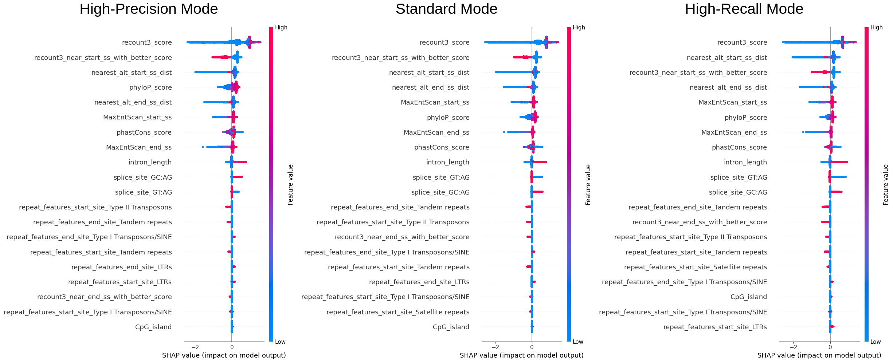
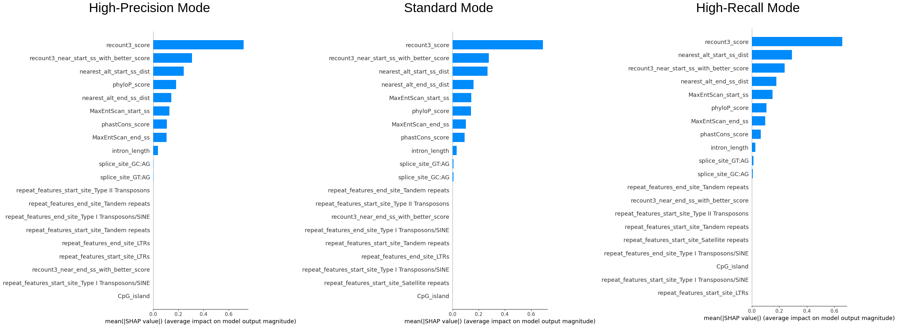
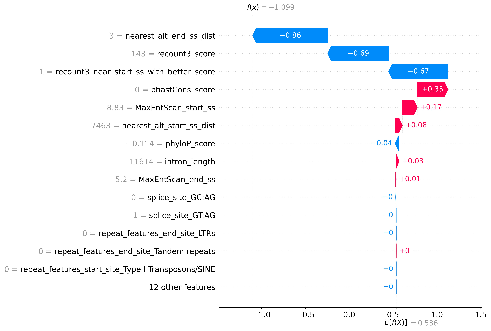

# Google Summer of Code 2023: <br/> Differentiating Real and Misaligned Introns with Machine Learning
[](LICENSE.txt)
[](https://www.python.org/downloads/release/python-3100/)
[](../../releases/tag/v0.1.0-alpha)
[](https://doi.org/10.5281/zenodo.14607093)

To address issue that strict filters rejects most of the legitimate introns,
we developed IntronOrNot (ION) - a machine learning to differentiate that predicts
if the intron is real or misaligned. The model accepts coordinates, .bed, and .gtf file as input.
The prediction script is easy to use and achieved comparable results
to sequence-based deep learning intron predictor. A standalone function
that extracts intron from .gtf is also included.


# Table of Contents
- [Organisation & Mentors](#organisation)
- [Getting Started](#getting-started)
  - [Usage](#usage)
- [Background](#background)
  - [Project Goal](#goal)
- [Training Set Preparation](#training-set)
  - [Positive Class Data](#pos-trainset)
  - [Negative Class Data](#neg-trainset)
- [Feature Engineering](#feature-eng)
  - [Features Tested](#feature-tested)
  - [Feature Selection](#feature-selection)
- [Machine Learning Model](#ml-model)
  - [Model Architecture](#model-arc)
  - [Hyperparameter Optimisation](#hyperparam-opt)
  - [Training](#model-training)
  - [Evaluation Metrics](#model-eval)
  - [Feature Importance using SHAP (SHapley Additive exPlanations)](#shap)
  - [Prediction Explanation](#pred-expl)
- [Results](#results)
  - [10-Fold Stratified Cross Validation](#cross-val)
  - [External Validation & Benchmark](#external-val)
  - [Summary](#test-summary)
- [Challenges, Limitations, and Future Work](#challenges-limitation-and-future-work)
- [Conclusion](#conclusion)
- [Acknowledgements and Remarks](#remarks)

# <a name="organisation"></a>Organisation & Mentors
Genome Assembly and Annotation (European Bioinformatics Institute / EMBL-EBI)

### Research Group
Ensembl - <a href="https://www.ebi.ac.uk/about/teams/genome-interpretation/">Genome Interpretation Teams</a>

### Mentors
<a href="https://www.ebi.ac.uk/people/person/jose-manuel-gonzalez-martinez/">Jose Gonzalez</a><br/>
<a href="https://www.ebi.ac.uk/people/person/jonathan-mudge/">Jonathan Mudge</a><br/>
<a href="https://www.ebi.ac.uk/people/person/adam-frankish/">Adam Frankish</a>

# Graphical Abstract


<p style="text-align: right;">Created with BioRender.com</p>

# <a name="getting-started"></a>Getting Started
### Installation
- Download the latest zipped folder `ION_version_x.x.x-x.zip` in [releases](../../releases/tag/v0.1.0-alpha)
- Install the required [dependencies](release/ION_version_0.0.1-alpha/environment.yml) (see below)

###  <a name="enviroment"></a>Environment
- 32 GB of RAM or more is required for a large .bed file
- Multi-thread support is defaulted to enabled with use of the Pandarallel library

### <a name="package-req"></a>Package Requirements
**!! Please Note that this requirement is for the final ION script in `Releases`, not the notebooks**\

Please see the [enviroment.yml](release/ION_version_0.0.1-alpha/environment.yml)

<details>
  <summary>View enviroment.yml</summary>
<pre>name: ion
channels:
  - conda-forge
  - bioconda
  - defaults
dependencies:
  - _libgcc_mutex=0.1
  - _openmp_mutex=4.5
  - bzip2=1.0.8
  - ca-certificates=2023.7.22
  - ld_impl_linux-64=2.40
  - libffi=3.4.2
  - libgcc-ng=13.2.0
  - libgomp=13.2.0
  - libnsl=2.0.0
  - libsqlite=3.43.0
  - libuuid=2.38.1
  - libzlib=1.2.13
  - ncurses=6.4
  - openssl=3.1.2
  - pip=23.2.1
  - python=3.10.12
  - readline=8.2
  - setuptools=68.2.2
  - tabix=0.2.6
  - tk=8.6.12
  - wheel=0.41.2
  - xz=5.2.6
  - zlib=1.2.13
  - pip:
    - bcbio-gff==0.7.0
    - biopython==1.81
    - cloudpickle==2.2.1
    - contourpy==1.1.1
    - cycler==0.11.0
    - dill==0.3.7
    - fonttools==4.42.1
    - joblib==1.3.2
    - kiwisolver==1.4.5
    - llvmlite==0.40.1
    - matplotlib==3.8.0
    - numba==0.57.1
    - numpy==1.24.4
    - packaging==23.1
    - pandarallel==1.6.5
    - pandas==1.5.3
    - pillow==10.0.1
    - psutil==5.9.5
    - pybigwig==0.3.22
    - pyfaidx==0.7.2.1
    - pyparsing==3.1.1
    - python-dateutil==2.8.2
    - pytz==2023.3.post1
    - scikit-learn==1.1.1
    - scipy==1.11.2
    - shap==0.42.1
    - six==1.16.0
    - slicer==0.0.7
    - threadpoolctl==3.2.0
    - tqdm==4.66.1
    - tzdata==2023.3
    - xgboost==1.6.2
</pre>
</details>

## <a name="usage"></a>Usage
Usage and options
```
ION.py [-h] --type {coord,gtf,bed} [-f FILE] [--shap SHAP] [--mode {standard,high-recall,high-precision,s,r,p}] [chr] [start] [end] [strand]

positional arguments:
  chr                   Chromosome name
  start                 Start position
  end                   End position
  strand                Strand (either + or -)

options:
  -h, --help            show this help message and exit
  --type {coord,gtf,bed}
                        Mode of operation
  -f FILE, --file FILE  Path to GTF/BED file
  --shap SHAP           True if you want SHAP (explanation of predicted result) plot, otherwise False. Defaulted to True for coord and False for bed/gtf mode
  --mode {standard,high-recall,high-precision,s,r,p}
                        Either standard high-recall or high-precision, defaulted to high-precision
```

Coordinate mode (1-based):
```
$ python3 ION.py --mode high-precision --type coord chr3 83979030 83990643 +

  
Running ION in high-precision mode, Output will be stored at:  output/run_1694416785
-----------------Results--------------------                                                                                                                                                                                                                                                                                                                                                                                   
Prediction Results: 0.24998539686203003
             Class: Rejected
--------------------------------------------
``` 
BED mode:
```
python3 ION.py --mode high-precision --type bed --file examples/example.bed 
``` 
GTF mode:
```
python3 ION.py --mode high-precision --type gtf --file examples/example.gtf
``` 
IMPORTANT: ION can only evaluate intorns with canonical splice-site (GT:AG, GC:AG, AT:AC)

# <a name="background"></a>Background
Understanding the impact of genetic variation on disease requires comprehensive gene annotation.
Human genes are well characterised following more than two decades of work on their annotation, however,
we know that this annotation is not complete and that new experimental methods are generating data
to help us towards the goal of complete gene annotation.

The advancement in the accuracy of long-read sequencing technology has allowed us to explore novel transcript variants of known genes.
Preventing potentially wrong transcripts and gene annotation is essential to the science community as many rely on the annotation for decision-making.
Automated workflow with a has been developed to minimise the time needed to verify and annotated those transcript variants. However,
current workflows are developed using a very strict rule-set and hence many of the novel transcript variants were rejected.
This project aims to address this issue by using machine learning to differentiate good quality but rejected transcripts,
using it as a standalone classification filter or analysing the decision-making methods of the model and consequently
improving the rule-set used in the automated workflow.

You can read more about the background of this project at: https://github.com/jmgonzmart/GSoC_ML_gene_annot

## <a name="goal"></a>Project Goal
This project consists of the following deliverables and goals:
- Install/prepare the environment and repository for the project.
- Extract the GENCODE annotation data and featurize them into tabular format.
- Explore the addition of other features that might facilitate decision-making or machine learning
model.
- Learn to generate an extended set of low-quality transcript or splice junction predictions.
- Develop a machine learning model that differentiate misaligned and real introns. The model should have low false positive rate.
- Perform and document the statistical analysis of the model to extract its most relevant features for
decision-making.
- Run the final model on novel transcripts and produce a detailed report of the results.

# <a name="training-set"></a>Training Set Preparation

## <a name="pos-trainset"></a>Positive Class Data

Relevant Notebook: [01](01_extract_introns_from_gencode.ipynb)

We used the GENCODE v44 (https://ftp.ebi.ac.uk/pub/databases/gencode/Gencode_human/release_44/) as our positive set. We
used a script to extract all the introns out of the .gtf file.

## <a name="neg-trainset"></a>Negative Class Data

Relevant Notebook: [02](02_extract_negative_introns.ipynb), [03](03_generating_false_introns.ipynb), [04](04_combining_positive_and_negative_train_set.ipynb)

We used two source for generating negative class data.

- We have access to a previous gene annotators' manually reviewed data, the dataset contains ~11000 introns, after removing introns that are already accepted in current version, 403 negative introns were obtained.

- To simulate how false intron data could be presented in real data, we ultilized [PBSIM3](https://academic.oup.com/nargab/article/4/4/lqac092/6855700) (Ono et al., 2022), a simulator for long-read sequencers that
is capable to simulate both PacBio RS II continuous long reads (CLR) and Oxford Nanopore Technology (ONT) reads. We simulated the reads using GENCODE v44 `Long non-coding RNA transcript sequences` and `Protein-coding transcript sequences` RNA data. We simulated them using four different settings:
  - ONT single pass - protein coding genes
  - ONT multi-pass - protein coding genes
  - PacBio Iso-seq - protein coding genes
  - ONT single pass - lcnRNA

The reads were then aligned to the human genome respectively using [Minimap2](https://doi.org/10.1093/bioinformatics/bty191) (Li, 2018), and intronic regions of all alignments were then extracted and
compared against the current GENCODE annotation and those that were not in the current GENCODE annotation is treated as false/misaligned introns. 
About 110,000 false introns were obtained.

# <a name="feature-eng"></a>Feature Engineering
## <a name="feature-tested"></a>Features Tested
9 categories of features were generated:
- Recount3 score: [Notebook 05](05_recount3_feature.ipynb)
  - Based on the data extracted from the intronic region of `recount3: summaries and queries for large-scale RNA-seq expression and splicing` (Wilks et al.)
- Repeat region: [Notebook 06](06_repeat_region_feature.ipynb)
  - Check if any of the splice-sites lies in repeating regions.
- Antisense Exon: [Notebook 07](07_antisense_feature.ipynb)
- Distance of next nearest existing splice-site: [Notebook 09](09_nearest_alternative_splice_site_distance_feature.ipynb)
  - Check the coordinate of both the donor and acceptor splice-site against current annotation (GENCODE v44) and calculate the distance between the splice site and the closest annotated splice-site nearby (excluding exact match).
- MaxEntScan score: [Notebook 10](10_maxentscan_score_feature.ipynb)
  - Based on the script/methodology developed by Yeo and Burge - `Maximum entropy modeling of short sequence motifs with applications to RNA splicing signals`
- Basic sequence based feature: [Notebook 11](11_basic_sequence_features.ipynb)
  - The process of pairing the sequence with the introns could be found in [Notebook 08](08_pairing_with_hg38.ipynb)
  - Calculates the GC content.
  - Determines whether the sequence can be considered a CpG island based on the ratio of CpG dinucleotides and the GC content in the sequence.
  - Calculates the intron length.
- Conservation scores: [Notebook 12](12_conservation_scores_feature.ipynb)
  - Calculate the splice-site conservation scores with the [PhastCon](https://doi.org/10.1101/gr.3715005) and [PhyloP](https://doi.org/10.1101%2Fgr.097857.109) conservation resources downloaded from the [UCSC genome browser](https://doi.org/10.1093%2Fbib%2Fbbs038).
- Splice-site with better Recount3 score nearby: [Notebook 13](13_recount3_near_ss_with_better_score_feature.ipynb)
  - We look at 5nt further at both direction of the splice-site and see if there is a splice-site recorded in recount3 that has a better score
- Branch Point Prediction (BPP) score: [Notebook 14](14_BPP_prediction_feature.ipynb)
  - Branch point prediction using [BPP](https://doi.org/10.1093/bioinformatics/btx401) (Zhang el al.)

## <a name="feature-selection"></a>Feature Selection
Relevant Notebook: [17](17_feature_selection.ipynb)

To make the model easier to interpret, and improve its performance. We simplify the model using feature selection.

We intentionally drop some features that we learned from empirical knowledge from the annotators are unimportant, namely the strand and chromosome of the introns.

We performed feature selection using RFECV:
Recursive Feature Elimination with Cross-Validation (RFECV) is a feature selection technique that aims to identify
a subset of features that are most useful for making accurate predictions. It is an extension of Recursive Feature
Elimination (RFE), which eliminates feature one by one according to their validation performance, RFECV incorporates
cross-validation (5-fold were chosen) for evaluation.

We also dropped the `sc` feature which is generated by the BPP script, as it has relatively less importance (reflected by the RFECV result) and not easily interpretable, and also introns lesser than certain length could not obtain the `sc` feature, we decided to remove it. 

24 features were chosen. Refer to the second last cell of [Notebook 17](17_feature_selection.ipynb) for more details.

# <a name="ml-model"></a>Machine Learning Model
## <a name="model-arc"></a>Model Architecture
We have tested different model architecture including Explainable Boosting Machine (EBM), RandomForest (RF), and more. We
chose XGBoost as the model for this task for its good performance in internal validation.

## <a name="hyperparam-opt"></a>Hyperparameter Optimisation
Relevant Notebook: [18](18_hyperparameter_optimisation.ipynb)

We chose the hyperparameter the XGBoost model using exhaustive grid searching with 3-fold cross-validation of the following parameter:
```
parameter_grid = {
    'n_estimators': [50, 100, 150, 200],
    'learning_rate': [0.01, 0.1, 0.2, 0.3],
    'max_depth': [5, 6, 7],
    'min_child_weight': [1, 3, 5],
    'subsample': [0.8, 0.9, 1.0],
    'colsample_bytree': [0.8, 0.9, 1.0]
}
```
The best parameters were combinations with `learning_rate = 0.1`, however after consideration our model has limited
training data, a learning rate with 0.1 will have a potential problem of overfitting, after evaluating different
combinations with internal validation, we opted to use `{'colsample_bytree': 0.9, 'learning_rate': 0.01, 'max_depth': 7, 'min_child_weight': 1, 'n_estimators': 200, 'subsample': 0.8}`,
which is the highest combination with `learning_rate = 0.01`.

## <a name="model-training"></a>Training

Relevant Notebook: [19a](19a_high_recall_model_building.ipynb), [19b](19b_standard_model_building.ipynb), [19c](19c_high_precision_model_building.ipynb)

We trained three separate model with the same parameter except for the `scale_pos_weight`. According to the xgboost 
documentation, it "control the balance of positive and negative weights, useful for unbalanced classes. A typical value 
to consider: sum(negative instances) / sum(positive instances)", after internal cross-validation, we settled on: 
- **High-Recall Mode**
  - `scale_pos_weight = sum(negative instances) / sum(positive instances)`
- **Standard Mode**
  - `scale_pos_weight = sum(negative instances) / sum(positive instances) / 2`
- **High-Precision Mode**
  - `scale_pos_weight = sum(negative instances) / sum(positive instances) / 4`

## <a name="model-eval"></a>Evaluation Metrics
The model's performance should be evaluated using metrics that consider both classes, metrics such as MCC should be emphasised.
We will evaluate our model using these metrics:
- Matthews Correlation Coefficient (MCC)
- Accuracy (Acc)
- Balanced Accuracy (BAcc)
- Precision
- Recall
- False Positive Rate (FPR)
  - This is espicially important because we need to ensure the model does not produce false positive
- Area Under Receiver Operating Characteristic Curve (AUROC)

## <a name="shap"></a>Feature Importance using SHAP (SHapley Additive exPlanations) 
One of the primary objectives of this project is to gain a deeper understanding of the significance of various features,
knowledge that could be leveraged to enhance existing filters. Gaining insights into the model's performance is not merely beneficial but crucial.
A more interpretable model could substantially contribute to more informed and effective decision-making processes.

We sampled 50% of the data (~240k entries) to examine the overall importance of features and how the value of features are affecting the model.\
The color reflects the value of the feature, the order of the features (vertically) is the importance of it, and the x-axis reflects
the impact on the model (SHAP value).



We can see that recount3 score is the most important feature and from the first plot we can see that the model
definitely favours entries with high recount3 score. One interesting finding is that phyloP or the phastCon score
is also an important feature, as it was not incorporated in the original filters used by the annotation team, this
could also be considered.


## <a name="pred-expl"></a>Prediction Explanation

You can export and view the explanation for the prediction using `--shap true` option, it is also defaulted to true in coordinates mode

### Example plot:


# <a name="results"></a>Results

Relevant Notebook: [20a](20a_external_benchmarking.ipynb), [20b](20b_external_benchmarking_gencode.ipynb)

We tested the tree mode of ION and compared it with the two filters provided by the annotators, and also compared it
to [SPLAM](https://doi.org/10.1101/2023.07.27.550754) (Chao et al., 2023).

## <a name="cross-val"></a>10-Fold Stratified Cross-Validation

|                           | Accuracy | B. Accuracy | FPR   | MCC   | AUROC<sub>score</sub> | Precision | Recall |
|---------------------------|----------|-------------|-------|-------|-----------------------|-----------|--------|
| ION (High-Recall Mode)    | 0.949    | 0.937       | 0.083 | 0.836 | 0.980                 | 0.982     | 0.956  |
| ION (Standard Mode)       | 0.933    | 0.933       | 0.068 | 0.800 | 0.980                 | 0.984     | 0.933  |
| ION (High-Precision Mode) | 0.894    | 0.917       | 0.046 | 0.722 | 0.980                 | 0.989     | 0.881  |

We can see that adjusting the `scale_pos_weight` parameter of the model allows us to lower to FPR (while sacrificing the overall predictive performance (indicated by MCC and Recall))

## <a name="external-val"></a>External Validation & Benchmark
### Manually annotated lncRNA test-set (Table 1)
|                           | Acc       | B. Acc    | FPR       | MCC       | AUROC<sub>score</sub> | Precision | Recall    |
|---------------------------|-----------|-----------|-----------|-----------|-----------------------|-----------|-----------|
| ION (High-Recall Mode)    | **0.860** | 0.724     | 0.443     | **0.361** | **0.858**             | 0.952     | **0.890** |
| ION (Standard Mode)       | 0.742     | **0.784** | 0.165     | 0.351     | 0.851                 | 0.978     | 0.732     |
| ION (High-Precision Mode) | 0.429     | 0.673     | **0.028** | 0.210     | 0.855                 | **0.992** | 0.374     |
| Filters (Intropolis)      | 0.366     | 0.633     | 0.040     | 0.171     | 0.633                 | 0.987     | 0.306     |
| Filters (Recount3)        | 0.701     | 0.654     | 0.403     | 0.191     | 0.654                 | 0.946     | 0.711     |
| SPLAM<sup>1</sup>         | 0.483     | 0.674     | 0.091     | 0.205     | 0.831                 | 0.674     | 0.674     |

1. True if both Donor score and Acceptor score >= 0.5 else false, actual predicted value (for calculating AUROC) is calculated by using the min(donor_score, acceptor_score).

### GENCODE v46 Newly Added Introns (Table 2)
As only single class is available (accepted/positive), only accuracy is included.

|                           | Accuracy  |
|---------------------------|-----------|
| ION (High-Recall mode)    | **0.844** |
| ION (Standard Mode)       | 0.708     |
| ION (High-Precision Mode) | 0.601     |
| SPLAM<sup>1</sup>         | 0.772     |

1. True if both Donor score and Acceptor score >= 0.5 else false

## <a name="test-summary"></a>Benchmarking Summary

Table 1 provides a comparative evaluation of different machine learning models designed to classify long non-coding
RNAs (lncRNAs) based on a manually annotated test set. Among the models, ION in High-Recall Mode stands out for its superior
performance across multiple metrics: it boasts the highest accuracy (0.860), Matthews Correlation Coefficient (0.361), and
AUROC score (0.858). It also excels in recall with a rate of 0.890, suggesting that it is particularly effective at correctly
identifying positive cases. However, this high recall comes at the expense of a higher False Positive Rate (FPR) of 0.443,
indicating that the model also incorrectly classifies a considerable number of negative cases as positive.
<br/><br/>
ION in Standard Mode achieves the highest Balanced Accuracy of 0.784 and maintains a relatively low FPR of 0.165,
offering a balanced performance between sensitivity and specificity. ION in High-Precision Mode excels in precision
with a score of 0.992 and has the lowest FPR of 0.028, but lags in recall and overall accuracy. Filters (Intropolis)
and Filters (Recount3) generally perform lower across most metrics, while SPLAM<sup>1</sup> shows moderate results.
Each model appears to have its strengths and weaknesses, providing options to choose based on the specific requirements
of an lncRNA classification task.
<br/><br/>
Table 2 provides comparison of models. As only accepted data are available in GENCODE, we can only compare their accuracy,
we can see that the high-recall mode of ION has the best accuracy, while other both the standard and high-precision mode suffered
from relatively low accuracy compared to SPLAM, which achieved 77.2%.

# <a name="challenges-limitation-and-future-work"></a>Challenges, Limitations, and Future Work
There are numerous challenges in this project. Most notably is the imbalance of the training data, as the majority of the data
are obtained by extracting introns from annotation, this makes the majority of the train-set "positive". This causes a huge
problem at the beginning, although we dampen it with the generation of false data, the ration of positive vs negative is still
around 4:1, a better model could be built with the generation of more false introns, presumably sets accumulated by annotators
or a more comprehensive simulation of introns using the method utilised in this project.

The performance of the machine learning model is limited to the training data, although recount3 is the most comprehensive dataset available to this data,
in the future, model should be retrained and adjusted in accordance to the newer data.

ION is built on many experimental and empirical data, like recount3 score, repeat regions, and conservation scores. On the other hand, there are
tools that predicts introns using the sequence alone, such as SpliceAI and SPLAM. Future work could expan on integrating both sequence-based
intron prediction and experimental data. Additionally, the recent development in protein structure predict might allow us to incorporate structural
prediction of the actual protein (analysis the legitimacy of introns using the final structure of the protein).

# <a name="conclusion"></a>Conclusion
We have successfully developed a model ION that predicts the legitimacy of an intron. The performance of ION is comparable
to deep learning methods such as SPLAM, while still being interpretable. This would allow annotators and users
to use this program to evaluate introns and understand the decision behind it. Many improvements could be make to improve
this model including generating higher quality "negative" introns and further tuning and experimenting with other features and models.

# <a name="remarks"></a>Acknowledgements and Remarks

I am truly grateful for the unwavering support I've received throughout the course of this project from the mentors.
Despite an initial slow start, my mentors have been incredibly supportive, providing invaluable guidance
through daily communication and during our regular meetings.

From the moment I was accepted into the program to its near completion, I have been continually awed and humbled by the
wealth of knowledge and skills I've gained through this experience. My primary focus has traditionally been in the realm
of computational bio/chemistry, which made the opportunity to delve into an unfamiliar domain through this
project all the more exhilarating for me.
