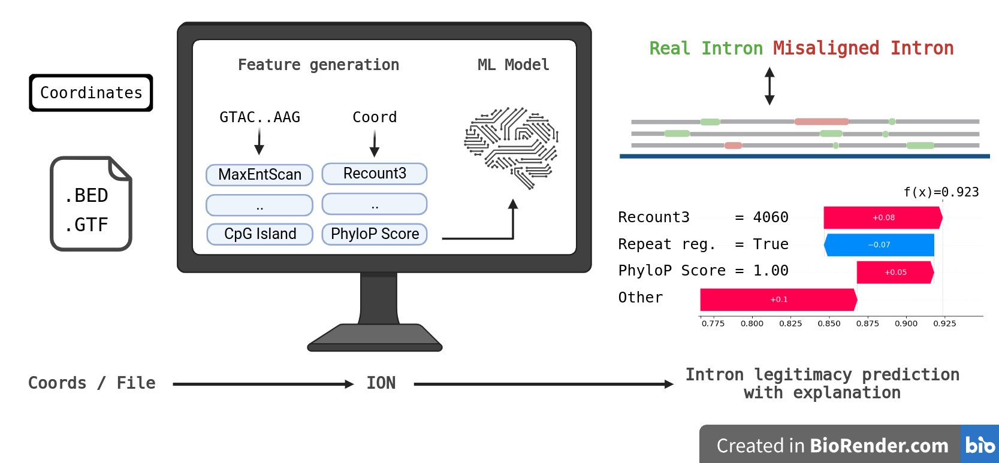

# Google Summer of Code 2023: <br/> Differentiating Real and Misaligned Introns with Machine Learning
## Organisation
Genome Assembly and Annotation (European Bioinformatics Institute / EMBL-EBI)

## Research Group
Ensembl - <a href="https://www.ebi.ac.uk/about/teams/genome-interpretation/">Genome Interpretation Teams</a>

## Mentors
<a href="https://www.ebi.ac.uk/people/person/jose-manuel-gonzalez-martinez/">Jose Gonzalez</a><br/>
<a href="https://www.ebi.ac.uk/people/person/jonathan-mudge/">Jonathan Mudge</a><br/>
<a href="https://www.ebi.ac.uk/people/person/adam-frankish/">Adam Frankish</a>

# Graphical Abstract



# Getting Started
### Installation
- Download the latest zipped script in `Releases`
- Install the required dependencies detailed below

###  Environment
- 32 GB of RAM or more is required for a large .bed file
- Multi-thread support is default to enabled with the Pandarallel library

### Package Requirements
**Please Note that this requirement is for the ION script in `Releases`, not the notebooks**\
<br/>
biopython==1.81\
matplotlib==3.5.2\
numpy==1.25.0\
pandarallel==1.6.5\
pandas==2.0.3\
pyBigWig==0.3.22\
pyfaidx==0.7.2.1\
scikit_learn==1.1.1\
shap==0.41.0\
tqdm==4.64.0\
xgboost==1.6.2\

## Usage
Coordinate mode:
```
python3 ION.py --mode standard --shap false --type coords chr12 126729967 126732342 -
``` 
BED mode:
```
python3 ION.py --mode standard --type bed --file ../../benchmarking/annotators_checked_introns.bed
``` 
GTF mode:
```
TBC
``` 

# Background
Understanding the impact of genetic variation on disease requires comprehensive gene annotation.
Human genes are well characterised following more than two decades of work on their annotation, however,
we know that this annotation is not complete and that new experimental methods are generating data
to help us towards the goal of complete gene annotation.

The advancement in the accuracy of long-read sequencing technology has allowed us to explore novel transcript variants of known genes.
Preventing potentially wrong transcripts and gene annotation is essential to the science community as many rely on the annotation for decision-making.
Automated workflow with a has been developed to minimise the time needed to verify and annotated those transcript variants. However,
current workflows are developed using a very strict rule-set and hence many of the novel transcript variants were rejected.
This project aims to address this issue by using machine learning to differentiate good quality but rejected transcripts,
using it as a standalone classification filter or analysing the decision-making methods of the model and consequently
improving the rule-set used in the automated workflow.

You can read more about the background of this project at: https://github.com/jmgonzmart/GSoC_ML_gene_annot

## Project Goal
This project consists of the following deliverables and goals:
- Install/prepare the environment and repository for the project.
- Extract the GENCODE annotation data and featurize them into tabular format.
- Explore the addition of other features that might facilitate decision-making or machine learning
model.
- Learn to generate an extended set of low-quality transcript or splice junction predictions.
- Develop a machine learning model that differentiate misaligned and real introns. The model should have low false positive rate.
- Perform and document the statistical analysis of the model to extract its most relevant features for
decision-making.
- Run the final model on novel transcripts and produce a detailed report of the results.

# Training Set Preparation

## Positive Class Data 

Relevant Notebook: [01](01_extract_introns_from_gencode.ipynb)

We used the GENCODE v44 (https://ftp.ebi.ac.uk/pub/databases/gencode/Gencode_human/release_44/) as our positive set. We
used a script to extract all the introns out of the .gtf file.

## Negative Class Data

Relevant Notebook: [02](02_extract_negative_introns.ipynb), [03](03_generating_false_introns.ipynb), [04](04_combining_positive_and_negative_train_set.ipynb)

We used two source for generating negative class data.

- We have access to a previously gene annotators' manually reviewed data, the dataset contains ~11000 introns, after removing introns that are already accepted in current version, 403 negative introns were obtained.

- To simulate how false intron data could be presented in real data, we ultilized [PBSIM3](https://academic.oup.com/nargab/article/4/4/lqac092/6855700) (Ono et al., 2022), a simulator for long-read sequencers that
is capable to simulate both PacBio RS II continuous long reads (CLR) and Oxford Nanopore Technology (ONT) reads. We simulated the reads using GENCODE v44 `Long non-coding RNA transcript sequences` and `Protein-coding transcript sequences` RNA data. We simulated them using four different settings:
  - ONT single pass - protein coding genes
  - ONT multi-pass - protein coding genes
  - PacBio Iso-seq - protein coding genes
  - ONT single pass - lcnRNA

The reads were then aligned to the human genome respectively using [Minimap2](https://doi.org/10.1093/bioinformatics/bty191) (Li, 2018), and intronic regions of all alignments were then extracted and
compared against the current GENCODE annotation and those that were not in the current GENCODE annotation is treated as false/misaligned introns. 
About 110,000 false introns were obtained.

# Feature Engineering
## Features Tested
9 categories of features were generated:
- Recount3 score: [Notebook 05](05_trainset_recount3_feature.tsv)
  - Based on the data extracted from the intronic region of `recount3: summaries and queries for large-scale RNA-seq expression and splicing` (Wilks et al.)
- Repeat region: [Notebook 06](06_trainset_repeat_feature.tsv)
  - Check if any of the splice-sites lies in repeating regions.
- Antisense Exon: [Notebook 07](07_trainset_antisense_feature.tsv)
- Distance of next nearest existing splice-site: [Notebook 09](09_trainset_nearest_alt_ss_dist_feature)
  - Check the coordinate of both the donor and acceptor splice-site against current annotation (GENCODE v44) and calculate the distance between the splice site and the closest annotated splice-site nearby (excluding exact match).
- MaxEntScan score: [Notebook 10](10_trainset_MaxEntScan_feature.tsv)
  - Based on the script/methodology developed by Yeo and Burge - `Maximum entropy modeling of short sequence motifs with applications to RNA splicing signals`
- Basic sequence based feature: [Notebook 11](11_trainset_basic_features.tsv)
  - Calculates the GC content.
  - Determines whether the sequence can be considered a CpG island based on the ratio of CpG dinucleotides and the GC content in the sequence.
  - Calculates the intron length.
- Conservation scores: [Notebook 12](12_trainset_conservation_scores_feature.tsv)
  - Calculate the splice-site conservation scores with the [PhastCon](https://doi.org/10.1101/gr.3715005) and [PhyloP](https://doi.org/10.1101%2Fgr.097857.109) conservation resources downloaded from the [UCSC genome browser](https://doi.org/10.1093%2Fbib%2Fbbs038).
- Splice-site with better Recount3 score nearby: [Notebook 13](13_recount3_near_ss_with_better_score_feature.tsv)
  - We look at 5nt further at both direction of the splice-site and see if there is a splice-site recorded in recount3 that has a better score
- Branch Point Prediction (BPP) score: [Notebook 14](14_trainset_BPP_score_feature.tsv)
  - Branch point prediction using [BPP](https://doi.org/10.1093/bioinformatics/btx401) (Zhang el al.)

## Feature Selection
Relevant Notebook: [17](17_feature_selection.ipynb)

To make the model easier to interpret, and improve its performance. We simplify the model using feature selection.

We intentionally drop some features that we learned from empirical knowledge from the annotators are unimportant, namely the strand and chromosome of the introns.

We performed feature selection using RFECV:
Recursive Feature Elimination with Cross-Validation (RFECV) is a feature selection technique that aims to identify
a subset of features that are most useful for making accurate predictions. It is an extension of Recursive Feature
Elimination (RFE), which eliminates feature one by one according to their validation performance, RFECV incorporates
cross-validation (5-fold were chosen) for evaluation.

We also dropped the `sc` feature which is generated by the BPP script, as it has relatively less importance (reflected by the RFECV result) and not easily interpretable, and also introns lesser than certain length could not obtain the `sc` feature, we decided to remove it. 

24 features were chosen. Refer to the second last cell of [Notebook 17](17_feature_selection.ipynb) for more details.

# Machine Learning Model
## Model Architecture
We have tested different model architecture including Explainable Boosting Machine (EBM), RandomForest (RF), and more. We
chose XGBoost as the model for this task for its good performance in internal validation.

## Hyperparameter Optimisation
Relevant Notebook: [18](18_hyperparameter_optimisation.ipynb)

We chose the hyperparameter the XGBoost model using exhaustive grid searching with 3-fold cross-validation of the following parameter:
```
parameter_grid = {
    'n_estimators': [50, 100, 150, 200],
    'learning_rate': [0.01, 0.1, 0.2, 0.3],
    'max_depth': [5, 6, 7],
    'min_child_weight': [1, 3, 5],
    'subsample': [0.8, 0.9, 1.0],
    'colsample_bytree': [0.8, 0.9, 1.0]
}
```
The selected parameters and the details could be found in [Notebook 18](18_hyperparameter_optimisation.ipynb).

## Training
We trained a standard model and a strict model.
- Standard Model
  - Uses `scale_pos_weight = 0.25` in the XGBoost parameter
- Strict Model
  - Uses `scale_pos_weight = 0.15` in the XGBoost parameter
  - Decision border scaled up to 0.8 (from conventionally 0.5)

## Evaluation Metrics
The model's performance should be evaluated using metrics that consider both classes, metrics such as accuracy could be misleading due to the high
number of true positives, especially during the training/internal-validation process.
- Matthews Correlation Coefficient (MCC)
- Balanced Accuracy (BAcc)
- False Positive Rate (FPR)
  - This is espicially important because we need to ensure the model does not produce false positive
- Area Under Receiver Operating Characteristic Curve (AUROC) 

# Results
## Internal Validation & Benchmark
## External Validation & Benchmark
## Summary

# Challenges

## Conclusion

# Acknowledgements and Remarks

I am truly grateful for the unwavering support I've received throughout the course of this project from the mentors.
Despite an initial slow start, my mentors have been incredibly supportive, providing invaluable guidance
through daily communication and during our regular meetings.

From the moment I was accepted into the program to its near completion, I have been continually awed and humbled by the
wealth of knowledge and skills I've gained through this experience. My primary focus has traditionally been in the realm
of computational bio/chemistry, which made the opportunity to delve into an unfamiliar domain through this
project all the more exhilarating for me.